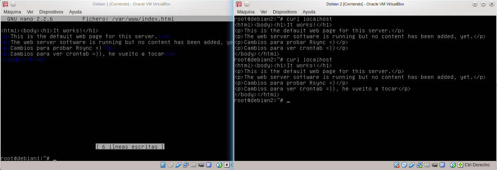

# Práctica 2 - Clonando un sitio web con Rsync

Como preparación metemos en el archivo **/etc/hosts** la IP y el nombre de la máquina contraria, para verse como un nombre y facilitar las cosas para el administrador.

```
root@debian1:~# nano /etc/hosts

192.168.1.200   debian2
```

```
root@debian2:~# nano /etc/hosts

192.168.1.100   debian1
```

## Prueba de copia por ssh

Creamos en debian1 un archivo hola.txt y lo mandamos por ssh a debian2 comprimido en tar.

```
root@debian1:~# touch prueba.txt
root@debian1:~# tar czf - prueba.txt | ssh debian2 'cat > ~/tar.tgz'
```

Y en debian2 nos aparecerá en /root/ el archivo tar.tgz

```
root@debian2:~# ls

touch prueba.txt
```

## Clonado de una carpeta entre dos máquinas

En ambas máquinas instalamos rsync

```
root@debian1:~# aptitude install rsync

root@debian2:~# aptitude install rsync
```
Antes de clonar, modificamos a nuestro gusto el directorio /var/www  de debian1, para ver si van bien los cambios.


Ahora clonamos la carpeta con la orden compleja para evitar copiar logs, errores o estadísiticas

```
root@debian2:~# rsync -avz --delete --exclude=**/stats --exclude=**/error --exclude=**/files/pictures -e "ssh -l root" root@debian1:/var/www/ /var/www/
```

Hacemos curl para comprobar si los cambios que hemos hecho en debian1 están en debian2

```
root@debian2:~# curl http://localhost
```

Y vemos que los cambios han surgido efecto.

## Acceso sin contraseña para SSH

Ejecutamos en debian2

```
#root@debian2:~# ssh-keygen -t dsa
```

Y dejamos la passphrase en blanco.

Ahora probamos a conectarnos desde debian2 a debian1 y servirá sin contraseña


## Programar tareas con crontab

Editaremos **/etc/crontab**

```
#root@debian2:~# nano /etc/crontab
```

Y añadimos esta línea

```
* * * * * root rsync -avz --delete --exclude=**/stats --exclude=**/error --exclude=**/files/pictures -e "ssh -l root" root@debian1:/var/www/ /var/www/
```


