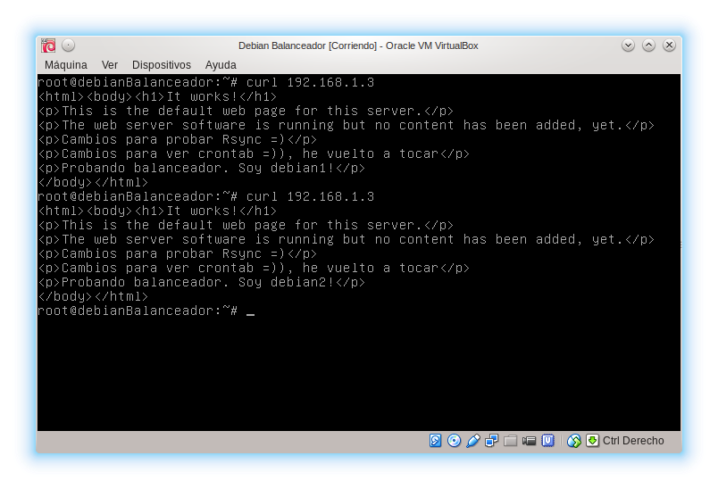
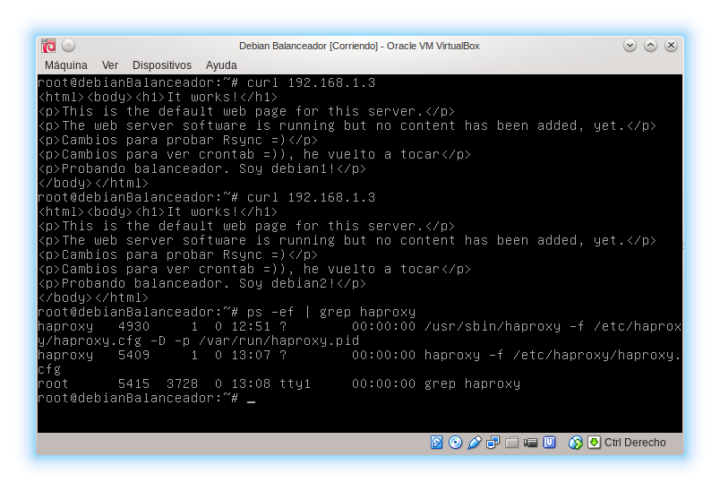

# Práctica 3 - Balanceo de carga

En esta práctica vamos a instalar nginx y haproxy para probarlos como balanceadores web.

Antes de empezar comentamos la línea que añadimos en la práctica 2 para clonar con Rsync la web de debian1 en debian2, para poder poner distintas webs en cada servidor y comprobar que el balanceador funciona.

# Instalando y configurando nginx

En Debian 7 está directamente en los repositorios oficiales, así que

```
root@debianBalanceador:~# aptitude install -y nginx
```

Ahora editamos el fichero **/etc/nginx/conf.d/default.conf** y definimos lo siguiente.

```
upstream apaches {
    server debian1;
    server debian2;
}

server{
    listen 80;
    server_name m3lb;
    access_log /var/log/nginx/m3lb.access.log;
    error_log /var/log/nginx/m3lb.error.log;
    root /var/www/;

    location /
    {
        proxy_pass http://apaches;
        proxy_set_header Host $host;
        proxy_set_header X-Real-IP $remote_addr;
        proxy_set_header X-Forwarded-For $proxy_add_x_forwarded_for;
        proxy_http_version 1.1;
        proxy_set_header Connection "";
    }
}
```

Paramos el servidor apache y lanzamos nginx

```
root@debianBalanceador:~# apachectl stop
root@debianBalanceador:~# service nginx restart
```

Y probamos que va bien.



Este método por defecto es round-robin (por turnos). Si queremos que la máquina debian1 tenga el doble de peso que debian2 configuramos la sección **upstream apaches** de la siguiente manera.

```
upstream apaches {
    server debian1 weight=4;
    server debian2 weight=2;
}
```

# Instalando y configurando HAProxy

Tal como vemos en **http://haproxy.debian.net/** este paquete está en la rama **wheezy-backports** por lo que vamos a activarlo tal como pone.

Modificamos **/etc/apt/sources.list** y añadimos

```
# wheezy-backports
deb http://cdn.debian.net/debian wheezy-backports main
```

Y ahora ejecutamos

```
root@debianBalanceador:~# aptitude update && aptitude install -y haproxy joe
```

El paquete **[joe](http://en.wikipedia.org/wiki/Joe%27s_Own_Editor)** es un editor de texto avanzado, que instalaremos por si nos hace falta, aunque usaré nano por comodidad.

Editamos el archivo **/etc/haproxy/haproxy.cfg**

```
# Configuración propia
global
    daemon
    maxconn 256

defaults
    mode http
    contimeout 4000
    clitimeout 42000
    srvtimeout 43000

frontend http-in
    bind *:80
    default_backend servers

backend servers
    server m1 debian1:80 maxconn 32
    server m2 debian2:80 maxconn 32
```

Y probamos que funciona


