# Comprobar el rendimiento de servidores web

Partimos de la granja web montada hasta la práctica 3. Para hacer las pruebas usaré mi máquina host
con Archlinux y añadiré adaptadores host-only a las máquinas balanceadora y debian1.

Para ello cargamos los módulos necesarios para tal cosa y creamos el adaptador. Lo haré vía consola
ya que es sólo una orden.

```
[antonio@Antonio-Arch ~]$ sudo modprobe vboxnetadp; sudo modprobe vboxnetflt
[antonio@Antonio-Arch ~]$ sudo VBoxManage hostonlyif create
```

Ahora en ambas máquinas añadimos un tercer adaptador de red "Sólo anfitrión" con nombre "vboxnet0",
que es el que acabamos de crear.

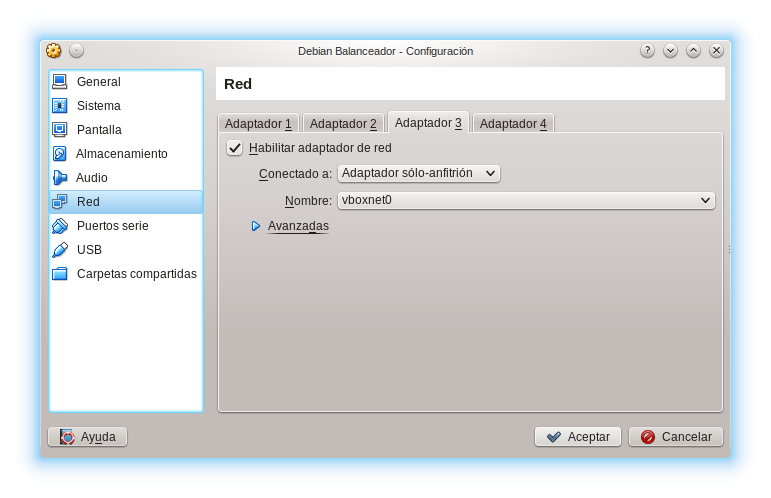

Para facilitar las pruebas, añadimos como ya sabemos a **/etc/hosts** las IP de ambas máquinas
y les ponemos un nombre.

Para conseguir las tablas usaré este [script](Scripts/pasoATablas.sh) que me formatea un .dat de los que saca cada uno de los scripts de cada programa a una tabla del estilo de markdown. Y para añadir el 0 líder a los números del tipo **0.loquesea**  usaremos sed, ya que bc los números de este tipo los deja como **.loquesea** y para las tablas quedan más homogéneos.

```
[antonio@Antonio-Arch SWAP1415]$ for file in Práctica\ 4\ -\ Comprobar\ el\ rendimiento\ de\ servidores\ web/Datos/*.dat; do sed -i.bak 's/ \./ 0\./g' $file; done
```

Después de ver que no hemos cometido errores borramos los .bak.

```
[antonio@Antonio-Arch SWAP1415]$ rm Práctica\ 4\ -\ Comprobar\ el\ rendimiento\ de\ servidores\ web/Datos/*.bak
```

## Apache Benchmark

Instalamos en mi máquina host el paquete apache.

```
[antonio@Antonio-Arch ~]$ sudo pacman -S apache
```

Este [script](Scripts/ab.sh) que ejecuta 10 veces ab y calcula la media y la desviación típica para un número creciente de peticiones. Aquí se muestran tablas y gráficas:

<table>
  <tr>
    <th colspan=7 style=text-align:center>Tiempo de test (ms)</th>
  </tr>
  <tr>
    <th></th>
    <th colspan=2 style=text-align:center>Servidor web</th>
    <th colspan=2 style=text-align:center>Granja Haproxy</th>
    <th colspan=2 style=text-align:center>Granja Nginx</th>
  </tr>
  <tr>
    <th>Peticiones totales</th>
    <th>Media</th>
    <th>Error</th>
    <th>Media</th>
    <th>Error</th>
    <th>Media</th>
    <th>Error</th>
   </tr>
  <tr>
    <td>1000
    <td>162.643
    <td>22.362
    <td>53.313
    <td>4.130
    <td>123.200
    <td>4.682
  </tr>
  <tr>
    <td>2000
    <td>285.246
    <td>37.225
    <td>75.985
    <td>2.918
    <td>208.573
    <td>52.075
  </tr>
  <tr>
    <td>4000
    <td>522.918
    <td>46.322
    <td>115.488
    <td>2.537
    <td>375.213
    <td>0
  </tr>
  <tr>
    <td>8000
    <td>1101.165
    <td>69.693
    <td>164.880
    <td>12.130
    <td>720.341
    <td>20.147
  </tr>
  <tr>
    <td>16000
    <td>2435.291
    <td>64.215
    <td>319.304
    <td>3.464
    <td>1500.214
    <td>31.254
  </tr>
</table>
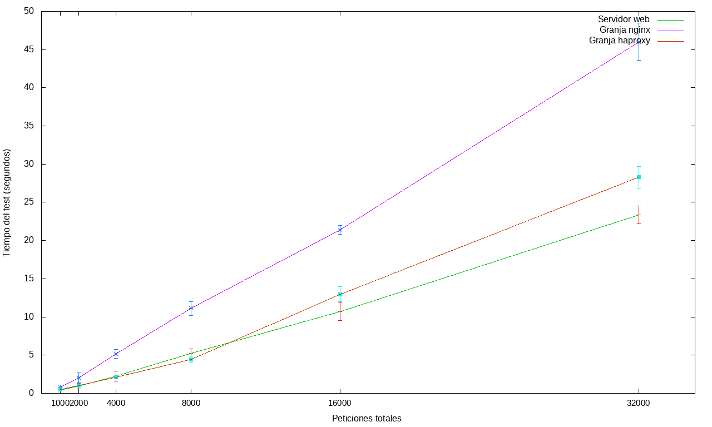


<table>
  <tr>
    <th colspan=7 style=text-align:center>Tiempo por petición (ms)</th>
  </tr>
  <tr>
    <th></th>
    <th colspan=2 style=text-align:center>Servidor web</th>
    <th colspan=2 style=text-align:center>Granja Haproxy</th>
    <th colspan=2 style=text-align:center>Granja Nginx</th>
  </tr>
  <tr>
    <th>Peticiones totales</th>
    <th>Media</th>
    <th>Error</th>
    <th>Media</th>
    <th>Error</th>
    <th>Media</th>
    <th>Error</th>
   </tr>
  <tr>
    <td>1000
    <td>162643.844
    <td>22361.969
    <td>53313.105
    <td>4130.473
    <td>123200.201
    <td>4682.312
  </tr>
  <tr>
    <td>2000
    <td>142622.953
    <td>18612.751
    <td>37992.906
    <td>1459.516
    <td>104286.663
    <td>26037.588
  </tr>
  <tr>
    <td>4000
    <td>130729.653
    <td>11580.645
    <td>28872.183
    <td>634.531
    <td>93803.295
    <td>0
  </tr>
  <tr>
    <td>8000
    <td>128349.737
    <td>8711.669
    <td>20610.020
    <td>1516.376
    <td>82142.837
    <td>2457.245
  </tr>
  <tr>
    <td>16000
    <td>121449.543
    <td>6402.674
    <td>19956.513
    <td>216.516
    <td>76014.25
    <td>3410.247
  </tr>
</table>
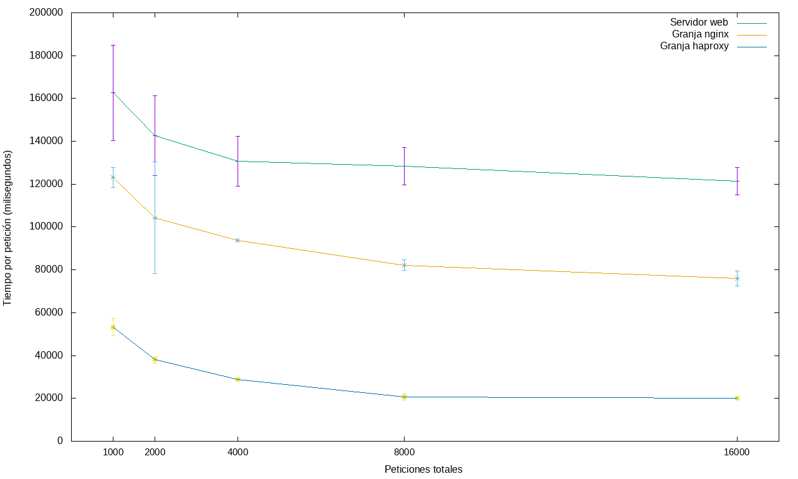


<table>
  <tr>
    <th colspan=7 style=text-align:center>Peticiones fallidas</th>
  </tr>
  <tr>
    <th></th>
    <th colspan=2 style=text-align:center>Servidor web</th>
    <th colspan=2 style=text-align:center>Granja Haproxy</th>
    <th colspan=2 style=text-align:center>Granja Nginx</th>
  </tr>
  <tr>
    <th>Peticiones totales</th>
    <th>Media</th>
    <th>Error</th>
    <th>Media</th>
    <th>Error</th>
    <th>Media</th>
    <th>Error</th>
   </tr>
  <tr>
    <td>1000
    <td>2012.285
    <td>30.093
    <td>720.000
    <td>326.908
    <td>1113.800
    <td>205.918
  </tr>
  <tr>
    <td>2000
    <td>4023.100
    <td>57.848
    <td>727.100
    <td>341.865
    <td>2686.714
    <td>749.126
  </tr>
  <tr>
    <td>4000
    <td>8023.000
    <td>29.512
    <td>941.800
    <td>328.728
    <td>4613.000
    <td>0
  </tr>
  <tr>
    <td>8000
    <td>16028.375
    <td>42.373
    <td>2137.900
    <td>571.832
    <td>8204.410
    <td>306.247
  </tr>
  <tr>
    <td>16000
    <td>32103.205
    <td>31.236
    <td>4351.500
    <td>402.847
    <td>17951.256
    <td>124.214
  </tr>
</table>
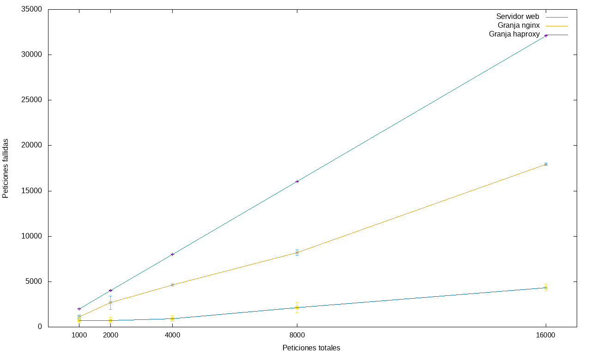


<table>
  <tr>
    <th colspan=7 style=text-align:center>Peticiones por segundo</th>
  </tr>
  <tr>
    <th></th>
    <th colspan=2 style=text-align:center>Servidor web</th>
    <th colspan=2 style=text-align:center>Granja Haproxy</th>
    <th colspan=2 style=text-align:center>Granja Nginx</th>
  </tr>
  <tr>
    <th>Peticiones totales</th>
    <th>Media</th>
    <th>Error</th>
    <th>Media</th>
    <th>Error</th>
    <th>Media</th>
    <th>Error</th>
   </tr>
  <tr>
    <td>1000
    <td>6.280
    <td>0.956
    <td>18.886
    <td>1.698
    <td>8.128
    <td>0.288
  </tr>
  <tr>
    <td>2000
    <td>7.132
    <td>0.928
    <td>26.360
    <td>1.030
    <td>10.342
    <td>3.115
  </tr>
  <tr>
    <td>4000
    <td>7.707
    <td>0.656
    <td>34.652
    <td>0.764
    <td>10.660
    <td>0
  </tr>
  <tr>
    <td>8000
    <td>7.295
    <td>0.454
    <td>48.764
    <td>3.313
    <td>11.242
    <td>0.357
  </tr>
  <tr>
    <td>16000
    <td>7.341
    <td>0.524
    <td>50.114
    <td>0.544
    <td>12.452
    <td>0.274
  </tr>
</table>
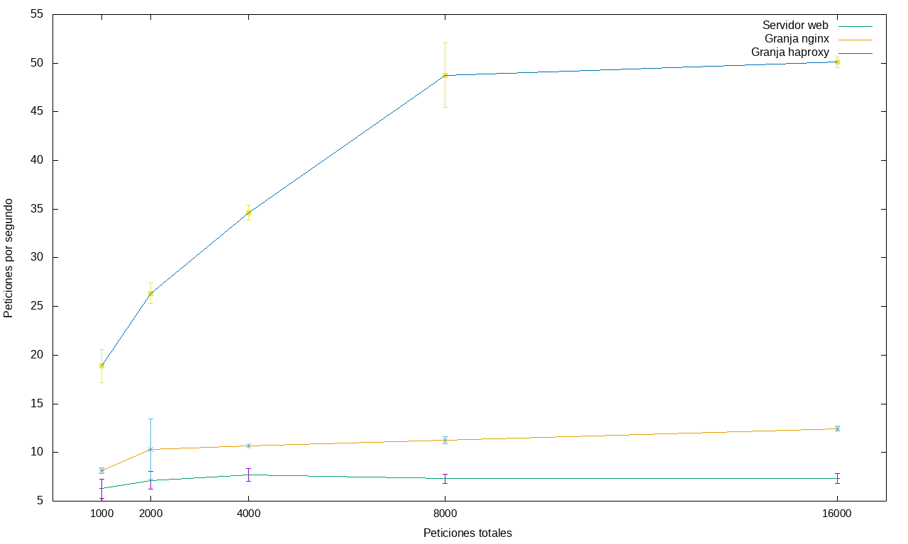

## Siege

Instalamos siege desde los repositorios oficiales

```
[antonio@Antonio-Arch ~]$ sudo pacman -S siege
```

Esta vez, por falta de tiempo, no usaremos script. Después de probar la misma página usando 10 usuarios concurrentes (Siege es muy duro y con 15 ya no era capaz la granja de servirlos) durante 60 segundos los resultados son estos.

```
[antonio@Antonio-Arch ~]$ siege -c 10 -t60S -v www.servidorswap.net
```
<table>
  <tr>
    <th colspan=3 style=text-align:center>Disponibilidad</th>
  </tr>
  <tr>
    <th colspan=1 style=text-align:center>Servidor web</th>
    <th colspan=1 style=text-align:center>Granja Nginx</th>
    <th colspan=1 style=text-align:center>Granja Haproxy</th>
  </tr>
  <tr>
    <td>25.00
    <td>66.67
    <td>100
  </tr>
</table>

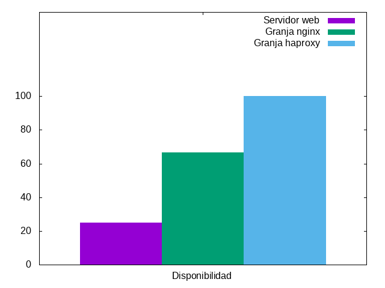

<table>
  <tr>
    <th colspan=3 style=text-align:center>Peticiones fallidas</th>
  </tr>
  <tr>
    <th colspan=1 style=text-align:center>Servidor web</th>
    <th colspan=1 style=text-align:center>Granja Nginx</th>
    <th colspan=1 style=text-align:center>Granja Haproxy</th>
  </tr>
  <tr>
    <td>9
    <td>6
    <td>0
  </tr>
</table>

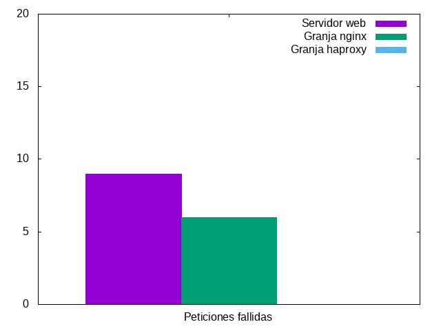

<table>
  <tr>
    <th colspan=3 style=text-align:center>Transacción más larga</th>
  </tr>
  <tr>
    <th colspan=1 style=text-align:center>Servidor web</th>
    <th colspan=1 style=text-align:center>Granja Nginx</th>
    <th colspan=1 style=text-align:center>Granja Haproxy</th>
  </tr>
  <tr>
    <td>28.47
    <td>29.21
    <td>22.34
  </tr>
</table>

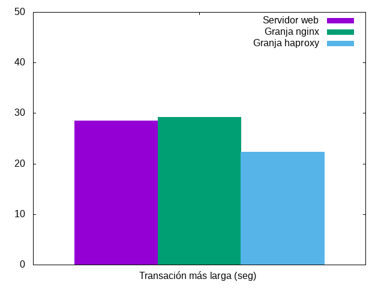

<table>
  <tr>
    <th colspan=3 style=text-align:center>Peticiones correctas</th>
  </tr>
  <tr>
    <th colspan=1 style=text-align:center>Servidor web</th>
    <th colspan=1 style=text-align:center>Granja Nginx</th>
    <th colspan=1 style=text-align:center>Granja Haproxy</th>
  </tr>
  <tr>
    <td>3
    <td>12
    <td>29
  </tr>
</table>

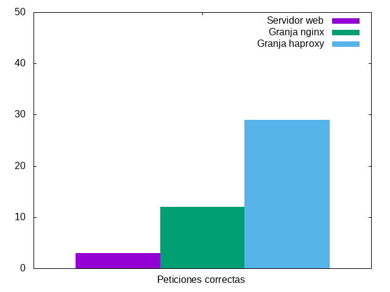

<table>
  <tr>
    <th colspan=3 style=text-align:center>Transacciones por segundo</th>
  </tr>
  <tr>
    <th colspan=1 style=text-align:center>Servidor web</th>
    <th colspan=1 style=text-align:center>Granja Nginx</th>
    <th colspan=1 style=text-align:center>Granja Haproxy</th>
  </tr>
  <tr>
    <td>0.05
    <td>0.20
    <td>0.49
  </tr>
</table>

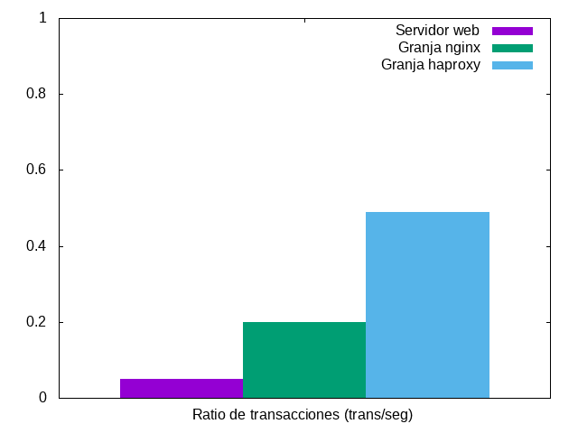

## OpenWebload

Para instalar [OpenWebLoad](http://openwebload.sourceforge.net/) en mi máquina host descargaré los fuentes desde la web oficial y los compilaré, aunque haciendo un pequeño cambio, ya que gcc sigue mucho los estándares de C y no comprende una línea de código.

Hay que eliminar **CTmplChunk::** de la línea 34 de **tmplchunk.h**, ya que está haciendo referencia a la propia clase y gcc no lo comprende.

Una vez hecho el cambio compilamos.

```
[antonio@Antonio-Arch ~]$ ./configure && make
```

Obviamos **make install** ya que no quiero instalarlo en mi sistema, me vale con tener el ejecutable. Lo copiamos de **src** a nuestra carpeta **Scripts** para lanzarlo desde nuestro clásico [script](Scripts/openload.sh) adaptado por supuesto a OpenWebLoad. Aquí tablas y gráficas.

<table>
  <tr>
    <th colspan=7 style=text-align:center>Transacciones por segundo</th>
  </tr>
  <tr>
    <th></th>
    <th colspan=2 style=text-align:center>Servidor web</th>
    <th colspan=2 style=text-align:center>Granja Haproxy</th>
    <th colspan=2 style=text-align:center>Granja Nginx</th>
  </tr>
  <tr>
    <th>Peticiones simultáneas</th>
    <th>Media</th>
    <th>Error</th>
    <th>Media</th>
    <th>Error</th>
    <th>Media</th>
    <th>Error</th>
   </tr>
  <tr>
    <td>1000
    <td>1489.306
    <td>99.191
    <td>934.587
    <td>55.534
    <td>993.452
    <td>141.418
  </tr>
  <tr>
    <td>2000
    <td>1302.320
    <td>42.580
    <td>804.775
    <td>38.427
    <td>685.626
    <td>22.142
  </tr>
  <tr>
    <td>4000
    <td>1264.723
    <td>40.757
    <td>793.222
    <td>29.121
    <td>653.818
    <td>24.893
  </tr>
  <tr>
    <td>8000
    <td>1255.720
    <td>27.982
    <td>783.628
    <td>30.206
    <td>606.884
    <td>27.231
  </tr>
  <tr>
    <td>16000
    <td>1226.347
    <td>46.773
    <td>784.225
    <td>21.690
    <td>578.779
    <td>18.853
  </tr>
  <tr>
    <td>32000
    <td>1184.855
    <td>44.167
    <td>765.891
    <td>24.834
    <td>562.155
    <td>19.122
  </tr>
</table>
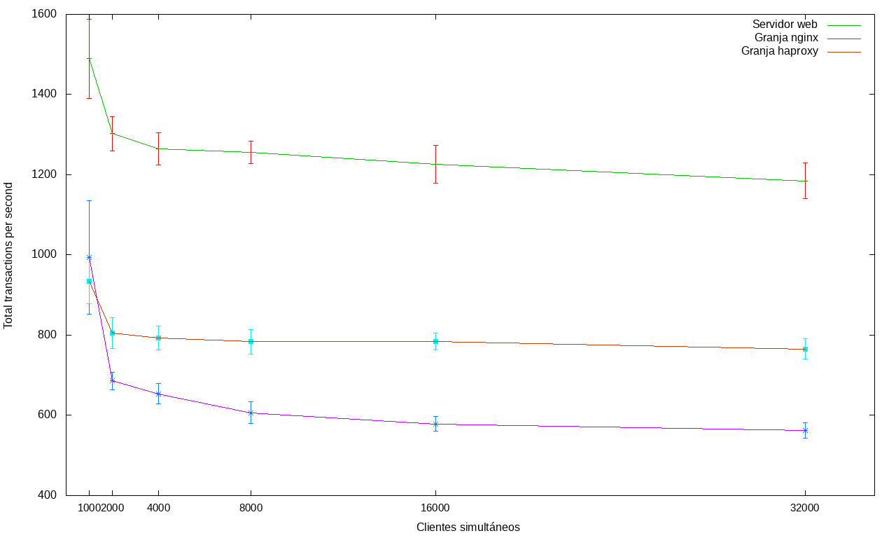

<table>
  <tr>
    <th colspan=7 style=text-align:center>Tiempo de respuesta medio</th>
  </tr>
  <tr>
    <th></th>
    <th colspan=2 style=text-align:center>Servidor web</th>
    <th colspan=2 style=text-align:center>Granja Haproxy</th>
    <th colspan=2 style=text-align:center>Granja Nginx</th>
  </tr>
  <tr>
    <th>Peticiones simultáneas</th>
    <th>Media</th>
    <th>Error</th>
    <th>Media</th>
    <th>Error</th>
    <th>Media</th>
    <th>Error</th>
   </tr>
  <tr>
    <td>1000
    <td>0.485
    <td>0.031
    <td>0.925
    <td>0.044
    <td>0.758
    <td>0.094
  </tr>
  <tr>
    <td>2000
    <td>0.555
    <td>0
    <td>1.084
    <td>0.054
    <td>1.031
    <td>0.031
  </tr>
  <tr>
    <td>4000
    <td>0.541
    <td>0
    <td>1.095
    <td>0.031
    <td>1.077
    <td>0.054
  </tr>
  <tr>
    <td>8000
    <td>0.582
    <td>0
    <td>1.110
    <td>0
    <td>1.129
    <td>0.054
  </tr>
  <tr>
    <td>16000
    <td>0.576
    <td>0
    <td>1.084
    <td>0.044
    <td>1.126
    <td>0.126
  </tr>
  <tr>
    <td>32000
    <td>0.619
    <td>0.031
    <td>1.117
    <td>0.044
    <td>1.228
    <td>0.070
  </tr>
</table>
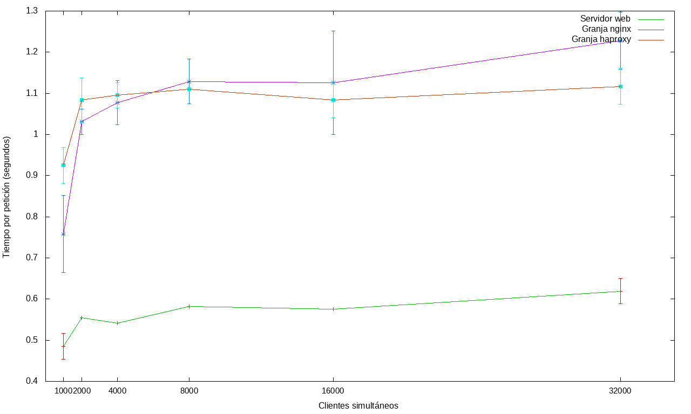
