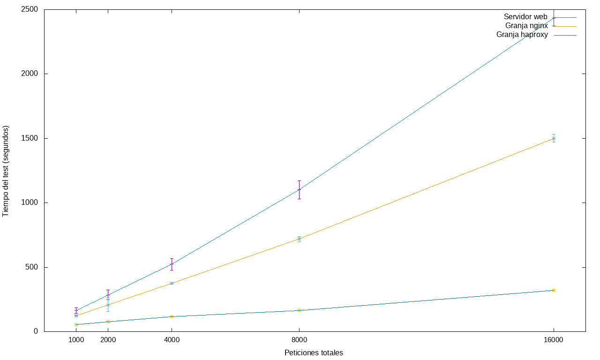

# Comprobar el rendimiento de servidores web

Partimos de la granja web montada hasta la práctica 3. Para hacer las pruebas usaré mi máquina host
con Archlinux y añadiré adaptadores host-only a las máquinas balanceadora y debian1.

Para ello cargamos los módulos necesarios para tal cosa y creamos el adaptador. Lo haré vía consola
ya que es sólo una orden.

```
[antonio@Antonio-Arch ~]$ sudo modprobe vboxnetadp; sudo modprobe vboxnetflt
[antonio@Antonio-Arch ~]$ sudo VBoxManage hostonlyif create
```

Ahora en ambas máquinas añadimos un tercer adaptador de red "Sólo anfitrión" con nombre "vboxnet0",
que es el que acabamos de crear.


Para facilitar las pruebas, añadimos como ya sabemos a **/etc/hosts** las IP de ambas máquinas
y les ponemos un nombre.

Para conseguir las tablas usaré este [script](Scripts/pasoATablas.sh) que me formatea un .dat de los que saca cada uno de los scripts de cada programa a una tabla del estilo de markdown. Y para añadir el 0 líder a los números del tipo **0.loquesea**  usaremos sed, ya que bc los números de este tipo los deja como **.loquesea** y para las tablas quedan más homogéneos.

```
[antonio@Antonio-Arch ~]$ for file in Datos/*.dat; do sed -i.bak 's/ \./ 0\./g' $file; done
```

Después de ver que no hemos cometido errores borramos los .bak.

```
[antonio@Antonio-Arch ~]$ rm Datos/*.bak
```

## Apache Benchmark

Instalamos en mi máquina host el paquete apache.

```
[antonio@Antonio-Arch ~]$ sudo pacman -S apache
```

Este [script](Scripts/ab.sh) que ejecuta 10 veces ab y calcula la media y la desviación típica para un número creciente de peticiones. Aquí se muestran tablas y gráficas:

<table>
  <tr>
    <th colspan=7 style=text-align:center>Tiempo de test (ms)</th>
  </tr>
  <tr>
    <th></th>
    <th colspan=2 style=text-align:center>Servidor web</th>
    <th colspan=2 style=text-align:center>Granja Haproxy</th>
    <th colspan=2 style=text-align:center>Granja Nginx</th>
  </tr>
  <tr>
    <th>Peticiones totales</th>
    <th>Media</th>
    <th>Error</th>
    <th>Media</th>
    <th>Error</th>
    <th>Media</th>
    <th>Error</th>
   </tr>
  <tr>
    <td>1000
    <td>0.424
    <td>0
    <td>0.522
    <td>0
    <td>0.773
    <td>0
  </tr>
  <tr>
    <td>2000
    <td>0.973
    <td>0.424
    <td>1.032
    <td>0
    <td>2.015
    <td>0.671
  </tr>
  <tr>
    <td>4000
    <td>2.243
    <td>0.651
    <td>2.086
    <td>0
    <td>5.150
    <td>0.601
  </tr>
  <tr>
    <td>8000
    <td>5.257
    <td>0.583
    <td>4.452
    <td>0.450
    <td>11.102
    <td>0.912
  </tr>
  <tr>
    <td>16000
    <td>10.734
    <td>1.190
    <td>12.984
    <td>0.977
    <td>21.422
    <td>0.576
  </tr>
  <tr>
    <td>32000
    <td>23.342
    <td>1.173
    <td>28.294
    <td>1.413
    <td>46.019
    <td>2.423
  </tr>
</table>


<table>
  <tr>
    <th colspan=7 style=text-align:center>Tiempo por petición (ms)</th>
  </tr>
  <tr>
    <th></th>
    <th colspan=2 style=text-align:center>Servidor web</th>
    <th colspan=2 style=text-align:center>Granja Haproxy</th>
    <th colspan=2 style=text-align:center>Granja Nginx</th>
  </tr>
  <tr>
    <th>Peticiones totales</th>
    <th>Media</th>
    <th>Error</th>
    <th>Media</th>
    <th>Error</th>
    <th>Media</th>
    <th>Error</th>
   </tr>
  <tr>
    <td>1000
    <td>8.488
    <td>0.277
    <td>10.456
    <td>0.311
    <td>15.472
    <td>0.574
  </tr>
  <tr>
    <td>2000
    <td>9.737
    <td>4.258
    <td>10.328
    <td>0.225
    <td>20.153
    <td>6.720
  </tr>
  <tr>
    <td>4000
    <td>11.216
    <td>3.262
    <td>10.429
    <td>0.181
    <td>25.754
    <td>3.012
  </tr>
  <tr>
    <td>8000
    <td>13.144
    <td>1.460
    <td>11.130
    <td>1.127
    <td>27.756
    <td>2.281
  </tr>
  <tr>
    <td>16000
    <td>13.417
    <td>1.488
    <td>16.230
    <td>1.221
    <td>26.778
    <td>0.721
  </tr>
  <tr>
    <td>32000
    <td>14.588
    <td>0.732
    <td>17.684
    <td>0.882
    <td>28.762
    <td>1.514
  </tr>
</table>


<table>
  <tr>
    <th colspan=7 style=text-align:center>Peticiones fallidas</th>
  </tr>
  <tr>
    <th></th>
    <th colspan=2 style=text-align:center>Servidor web</th>
    <th colspan=2 style=text-align:center>Granja Haproxy</th>
    <th colspan=2 style=text-align:center>Granja Nginx</th>
  </tr>
  <tr>
    <th>Peticiones totales</th>
    <th>Media</th>
    <th>Error</th>
    <th>Media</th>
    <th>Error</th>
    <th>Media</th>
    <th>Error</th>
   </tr>
  <tr>
    <td>1000
    <td>0
    <td>0
    <td>0
    <td>0
    <td>0
    <td>0
  </tr>
  <tr>
    <td>2000
    <td>0
    <td>0
    <td>0
    <td>0
    <td>0
    <td>0
  </tr>
  <tr>
    <td>4000
    <td>0
    <td>0
    <td>0
    <td>0
    <td>0
    <td>0
  </tr>
  <tr>
    <td>8000
    <td>0
    <td>0
    <td>0
    <td>0
    <td>0
    <td>0
  </tr>
  <tr>
    <td>16000
    <td>0
    <td>0
    <td>0
    <td>0
    <td>0
    <td>0
  </tr>
  <tr>
    <td>32000
    <td>0
    <td>0
    <td>0
    <td>0
    <td>0
    <td>0
  </tr>
</table>


<table>
  <tr>
    <th colspan=7 style=text-align:center>Peticiones por segundo</th>
  </tr>
  <tr>
    <th></th>
    <th colspan=2 style=text-align:center>Servidor web</th>
    <th colspan=2 style=text-align:center>Granja Haproxy</th>
    <th colspan=2 style=text-align:center>Granja Nginx</th>
  </tr>
  <tr>
    <th>Peticiones totales</th>
    <th>Media</th>
    <th>Error</th>
    <th>Media</th>
    <th>Error</th>
    <th>Media</th>
    <th>Error</th>
   </tr>
  <tr>
    <td>1000
    <td>2358.663
    <td>76.471
    <td>1914.464
    <td>56.585
    <td>1294.336
    <td>46.076
  </tr>
  <tr>
    <td>2000
    <td>2255.956
    <td>465.938
    <td>1937.404
    <td>42.566
    <td>1086.288
    <td>282.534
  </tr>
  <tr>
    <td>4000
    <td>1932.417
    <td>520.076
    <td>1918.210
    <td>34.011
    <td>786.325
    <td>83.452
  </tr>
  <tr>
    <td>8000
    <td>1537.986
    <td>148.113
    <td>1811.966
    <td>149.597
    <td>725.619
    <td>61.653
  </tr>
  <tr>
    <td>16000
    <td>1511.122
    <td>187.048
    <td>1239.216
    <td>93.159
    <td>747.425
    <td>20.073
  </tr>
  <tr>
    <td>32000
    <td>1374.406
    <td>69.817
    <td>1133.998
    <td>60.784
    <td>697.277
    <td>36.610
  </tr>
</table>


## HTTPperf

Instalamos httperf desde los repositorios oficiales

```
[antonio@Antonio-Arch ~]$ sudo pacman -S httperf
```

Y usando este [script](Scripts/httperf.sh), que está adaptado del de ab, sacamos estas tablas y gráficas.

## Openload

Para instalar [OpenWebLoad](http://openwebload.sourceforge.net/) en mi máquina host descargaré los fuentes desde la web oficial y los compilaré, aunque haciendo un pequeño cambio, ya que gcc sigue mucho los estándares de C y no comprende una línea de código.

Hay que eliminar **CTmplChunk::** de la línea 34 de **tmplchunk.h**, ya que está haciendo referencia a la propia clase y gcc no lo comprende.

Una vez hecho el cambio compilamos.

```
[antonio@Antonio-Arch ~]$ ./configure && make
```

Obviamos **make install** ya que no quiero instalarlo en mi sistema, me vale con tener el ejecutable. Lo copiamos de **src** a nuestra carpeta **Scripts** para lanzarlo desde nuestro clásico [script](Scripts/openload.sh) adaptado por supuesto a OpenWebLoad. Aquí tablas y gráficas.

<table>
  <tr>
    <th colspan=7 style=text-align:center>Transacciones por segundo</th>
  </tr>
  <tr>
    <th></th>
    <th colspan=2 style=text-align:center>Servidor web</th>
    <th colspan=2 style=text-align:center>Granja Haproxy</th>
    <th colspan=2 style=text-align:center>Granja Nginx</th>
  </tr>
  <tr>
    <th>Peticiones simultáneas</th>
    <th>Media</th>
    <th>Error</th>
    <th>Media</th>
    <th>Error</th>
    <th>Media</th>
    <th>Error</th>
   </tr>
  <tr>
    <td>1000
    <td>1489.306
    <td>99.191
    <td>934.587
    <td>55.534
    <td>993.452
    <td>141.418
  </tr>
  <tr>
    <td>2000
    <td>1302.320
    <td>42.580
    <td>804.775
    <td>38.427
    <td>685.626
    <td>22.142
  </tr>
  <tr>
    <td>4000
    <td>1264.723
    <td>40.757
    <td>793.222
    <td>29.121
    <td>653.818
    <td>24.893
  </tr>
  <tr>
    <td>8000
    <td>1255.720
    <td>27.982
    <td>783.628
    <td>30.206
    <td>606.884
    <td>27.231
  </tr>
  <tr>
    <td>16000
    <td>1226.347
    <td>46.773
    <td>784.225
    <td>21.690
    <td>578.779
    <td>18.853
  </tr>
  <tr>
    <td>32000
    <td>1184.855
    <td>44.167
    <td>765.891
    <td>24.834
    <td>562.155
    <td>19.122
  </tr>
</table>


<table>
  <tr>
    <th colspan=7 style=text-align:center>Tiempo de respuesta medio</th>
  </tr>
  <tr>
    <th></th>
    <th colspan=2 style=text-align:center>Servidor web</th>
    <th colspan=2 style=text-align:center>Granja Haproxy</th>
    <th colspan=2 style=text-align:center>Granja Nginx</th>
  </tr>
  <tr>
    <th>Peticiones simultáneas</th>
    <th>Media</th>
    <th>Error</th>
    <th>Media</th>
    <th>Error</th>
    <th>Media</th>
    <th>Error</th>
   </tr>
  <tr>
    <td>1000
    <td>0.485
    <td>0.031
    <td>0.925
    <td>0.044
    <td>0.758
    <td>0.094
  </tr>
  <tr>
    <td>2000
    <td>0.555
    <td>0
    <td>1.084
    <td>0.054
    <td>1.031
    <td>0.031
  </tr>
  <tr>
    <td>4000
    <td>0.541
    <td>0
    <td>1.095
    <td>0.031
    <td>1.077
    <td>0.054
  </tr>
  <tr>
    <td>8000
    <td>0.582
    <td>0
    <td>1.110
    <td>0
    <td>1.129
    <td>0.054
  </tr>
  <tr>
    <td>16000
    <td>0.576
    <td>0
    <td>1.084
    <td>0.044
    <td>1.126
    <td>0.126
  </tr>
  <tr>
    <td>32000
    <td>0.619
    <td>0.031
    <td>1.117
    <td>0.044
    <td>1.228
    <td>0.070
  </tr>
</table>

