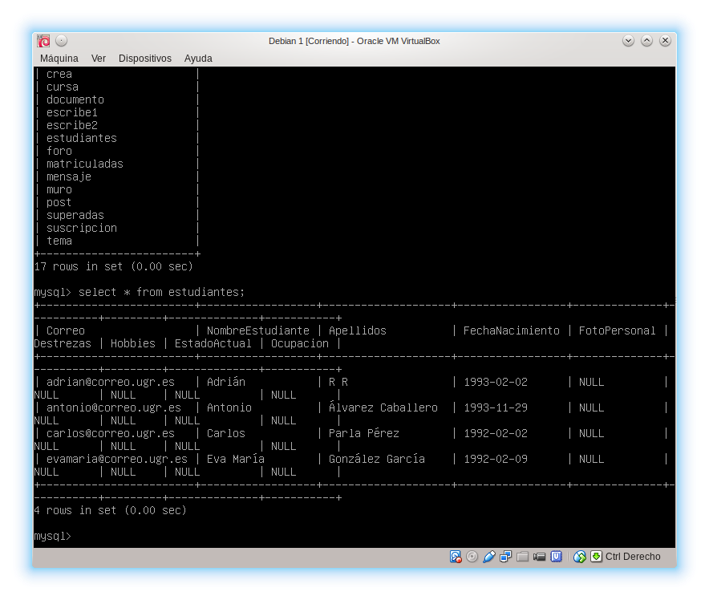
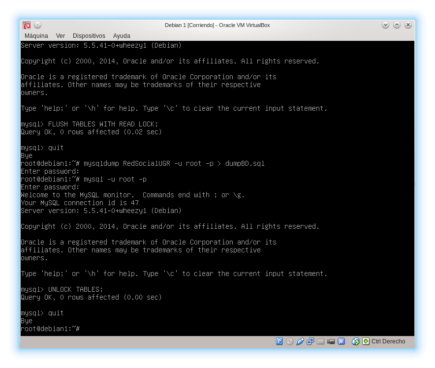
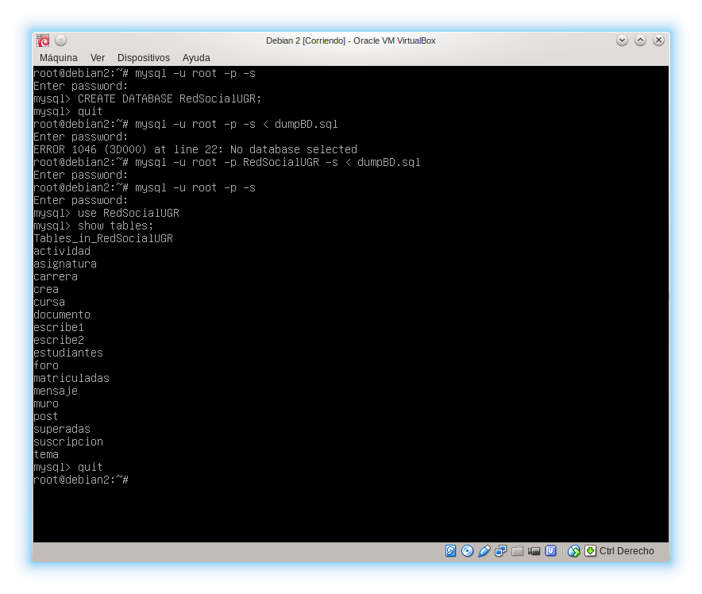
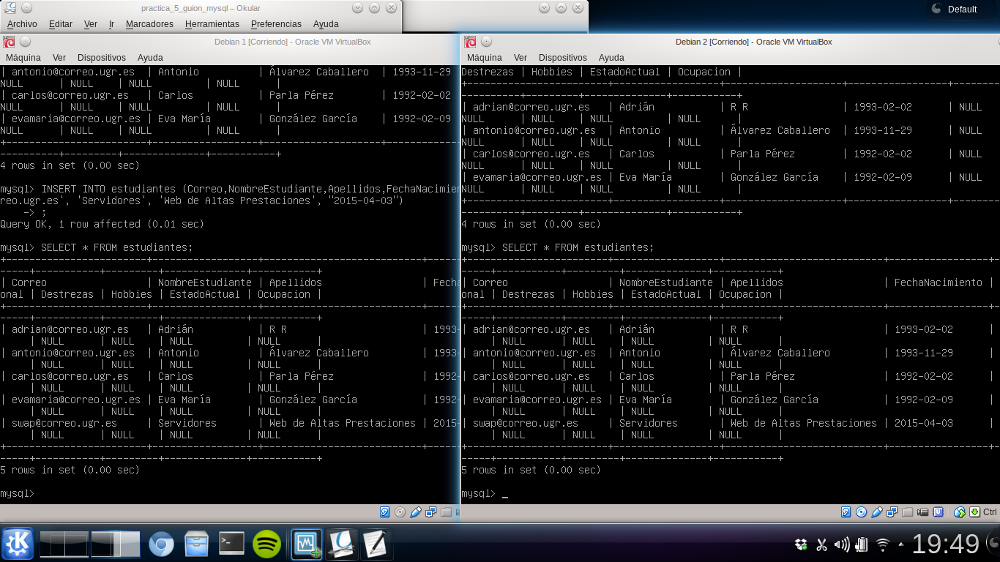

# Replicación de bases de datos MySQL

En esta práctica aprenderemos a replicar bases de datos MySQL.

## Creando una base de datos

Usaremos una base de datos ya creada de un [proyecto](https://github.com/analca3/RedSocialUGR) de una asignatura anterior. Nos descargaremos RedSocialUGR.sql en debian1 y lo añadiremos a la base de datos usando

```
root@debian1:~# mysql -u root -p < RedSocialUGR.sql
```

Comprobamos que haya alguna tabla con datos y proseguimos.



## Replicación manual usando mysqldump

Tal como viene en el guión, primero bloqueamos la base de datos para que nadie modifique nada durante la copia de seguridad. En la consola mysql ejecutamos

```
root@debian1:~# mysql -u root -p -s
mysql> FLUSH TABLES WITH READ LOCK;
mysql> quit
```

Y ahora en la consola de debian1 ejecutamos

```
root@debian1:~# mysqldump RedSocialUGR -u root -p > dumpBD.sql
```

Y ahora desbloqueamos las tablas

```
root@debian1:~# mysql -u root -p -s
mysql> UNLOCK TABLES;
mysql> quit
```



Ahora desde debian2 nos traemos dicho dump y lo volcamos en nuestro sistema. Previamente tenemos que crear la base de datos, ya que mysqldump no la crea.

```
root@debian2:~# scp root@debian1:dumpBD.sql .
root@debian2:~# mysql -u root -p -s
mysql> CREATE DATABASE RedSocialUGR;
mysql> quit
root@debian2:~# mysql RedSocialUGR -u root -p < dumpBD.sql
```



## Replicación mediante configuración maestro-esclavo

Ahora seguimos el guión poco a poco (No es tanta configuración como parece) para conseguir que debian2 sea un esclavo de debian1.

En el maestro, debian1, abrimos **/etc/mysql/my.cnf**:

- Descomentar    bind-address 127.0.0.1
- Añadir      log_error = /var/log/mysql/error.log
- Descomentar server-id = 1
- Descomentar log_bin = /var/log/mysql/bin.log

Después de esto reiniciamos el servicio.

```
root@debian1:~# service mysql restart
```

En el esclavo, debian2, abrimos **/etc/mysql/my.cnf**:

- Descomentar server-id = 1 y cambiarlo por 2

Reiniciamos el servicio

```
root@debian2:~# service mysql restart
```

Ahora abrimos mysql en el servidor y ejecutamos

```
mysql> CREATE USER esclavo IDENTIFIED BY 'esclavo';
mysql> GRANT REPLICATION SLAVE ON *.* TO 'esclavo'@'%' IDENTIFIED BY 'esclavo';
mysql> FLUSH PRIVILEGES;
mysql> FLUSH TABLES;
mysql> FLUSH TABLES WITH READ LOCK;
```

Ahora abrimos mysql en el esclavo y ejecutamos

```
mysql> CHANGE MASTER TO MASTER_HOST='debian1',
MASTER_USER='esclavo', MASTER_PASSWORD='esclavo',
MASTER_LOG_FILE='mysql-bin.000001', MASTER_LOG_POS=501,
MASTER_PORT=3306;
mysql> GRANT REPLICATION SLAVE ON *.* TO 'esclavo'@'%' IDENTIFIED BY 'esclavo';
mysql> START SLAVE;
```

Y desbloqueamos las tablas en el maestro

```
mysql> UNLOCK TABLES;
```

El resultado será este


