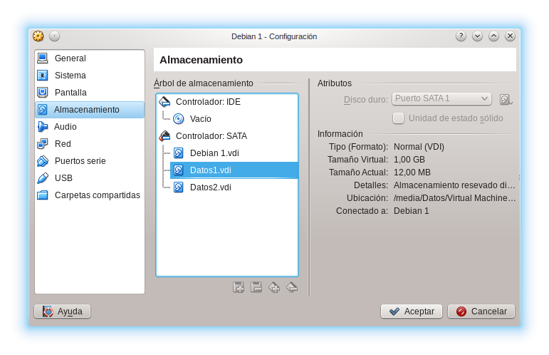
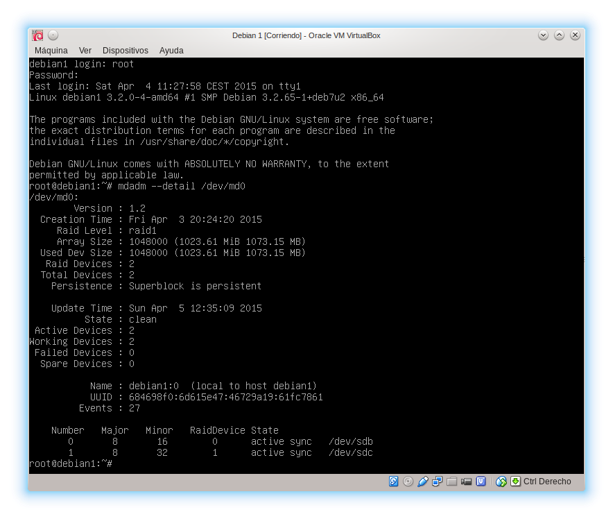
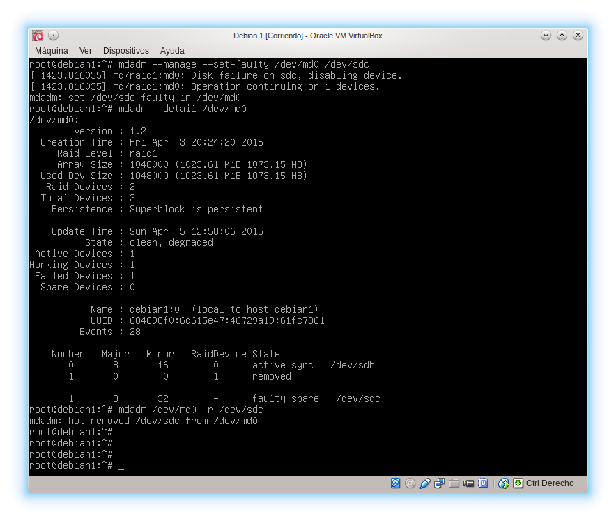
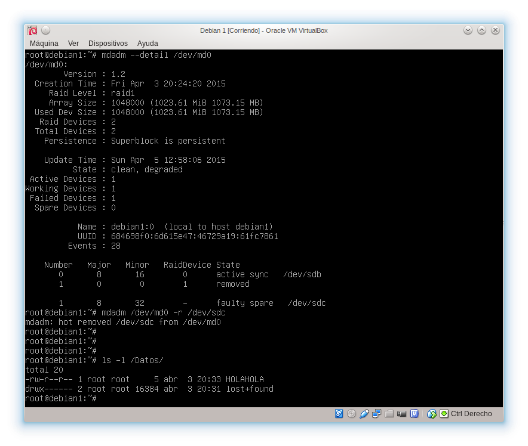
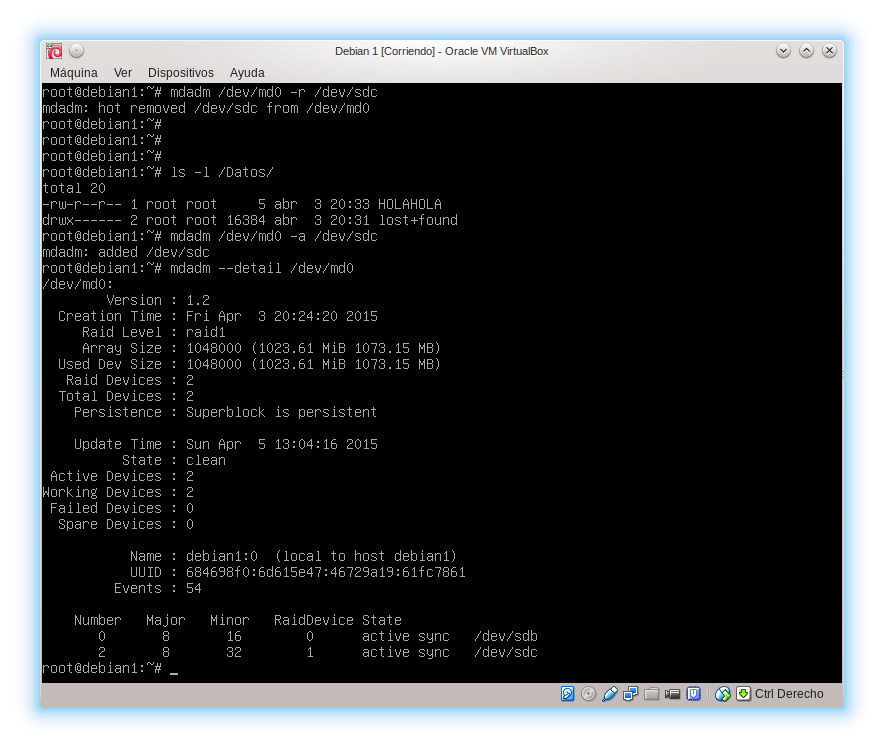

# Discos en RAID

Cogeremos nuestra máquina debian1 y configuraremos un RAID1 por software usando mdadm.

Estando la máquina apagada, le añadimos dos discos más del mismo formato y capacidad.



Arrancamos la máquina e instalamos mdadm

```
root@debian1:~# aptitude install -y mdadm
```

Ahora vemos los nombres que le ha dado el sistema a los discos

```
root@debian1:~# fdisk -l
```

Lo cual nos dice que los dos discos son **/dev/sdb** y **/dev/sdc**. Por tanto creamos el RAID1 con dichos discos.

```
root@debian1:~# mdadm -C /dev/md0 --level=raid1 --raid-devices=2 /dev/sdb /dev/sdc
```

Le damos formato al array creado.

```
root@debian1:~# mkfs.ext4 /dev/md0
```

Creamos el directorio **/Datos** y montamos el array.

```
root@debian1:~# mkdir /Datos; mount /dev/md0 /Datos
```

Y comprobamos que el array va perfectamente.

```
root@debian1:~# mdadm --detail /dev/md0
```



Para probar el automontaje y posteriormente forzar un fallo en el array y ver que podemos seguir utilizando los datos, creamos un fichero **HOLAHOLA** en **/Datos**.

Para automontar el array en el directorio /Datos modificamos el archivo **/etc/fstab**, pero antes debemos ver el UUID de la partición del array. No confundir con el UUID del propio array, que no es lo mismo. Para ver dicho valor hay muchas herramientas: blkid, lsblk... Yo estoy acostumbrado a usar, simplemente, el sistema de archivos de GNU/Linux.

```
root@debian1:~# ls -l /dev/disk/by-uuid
```

Una vez tengamos el UUID de la partición del array lo copiamos y añadimos en el fstab. En mi caso la línea a añadir al final del fichero es

```
UUID=f90f4b24-7049-45b5-ab81-27fecda61ffa /Datos ext4 defaults 0 0
```

Así cada vez que arranquemos el sistema se montará el array automáticamente. Las opciones por defecto nos sirven sin ningún problema, aunque podríamos cambiar muchas cosas.

## Simulando un fallo en una unidad

Según la wiki de Linux RAID, podemos forzar un fallo en una unidad con mdadm.

```
root@debian1:~# mdadm --manage --set-faulty /dev/md0 /dev/sdc
```



Y comprobamos que después de haber quitado dicho disco del array podemos seguir accediendo a **/Datos**.

```
root@debian1:~# ls -l /Datos
```



Como vemos aún podemos acceder al fichero **HOLAHOLA** que habíamos creado.

Después de arreglar el disco roto, o sustituirlo, lo volvemos a añadir al array.

```
root@debian1:~# mdadm /dev/md0 -a /dev/sdc
```

Y comprobamos que todo sigue funcionando.



## Bibliografía adicional

[Linux RAID Wiki](https://raid.wiki.kernel.org/index.php/Detecting,_querying_and_testing)
